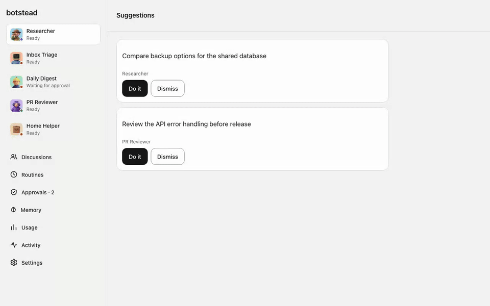
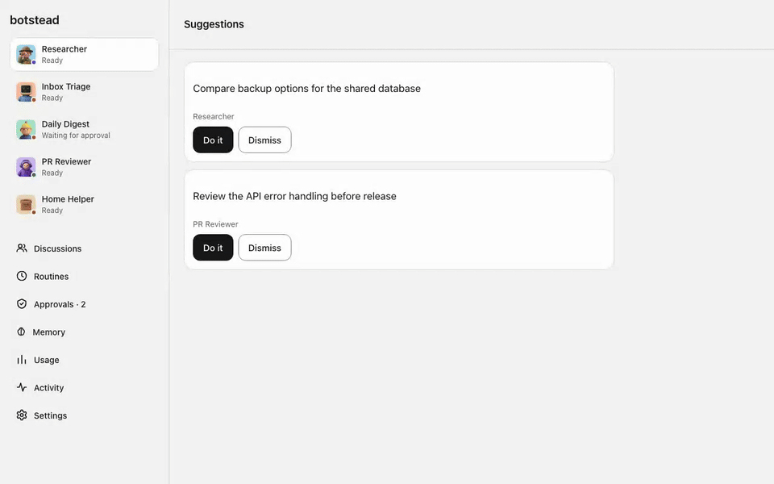
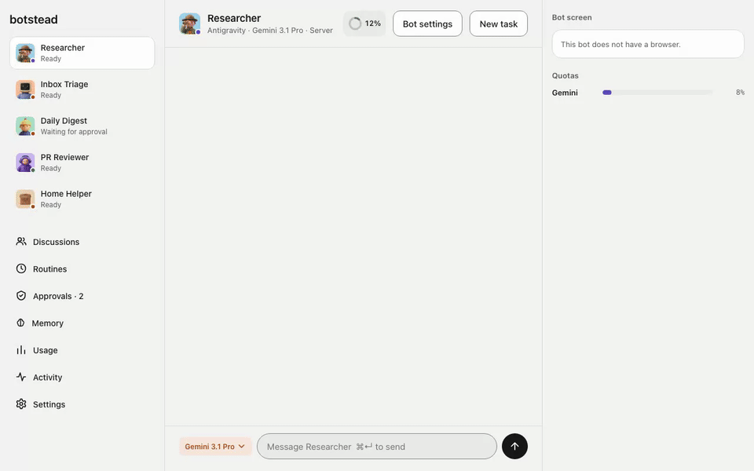
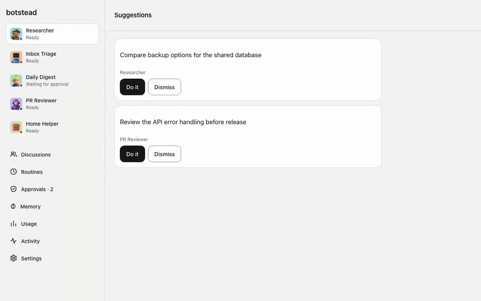
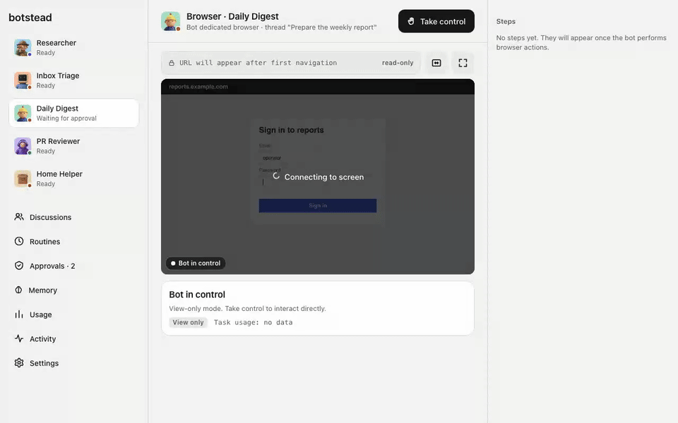
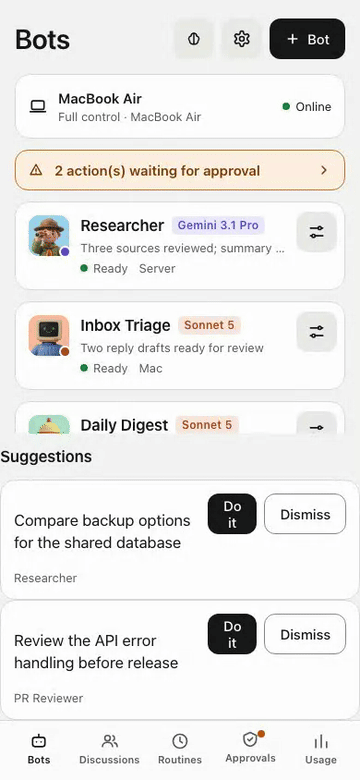

# Botstead

Botstead is an open-source, self-hosted platform for running autonomous AI bots. Each container-backed bot runs on its own isolated virtual computer with a dedicated Linux container and a dedicated headed web browser.

## See it in action

**Create from catalog.** Pick the research template, name the bot Researcher, and open its thread.



**Group debate.** Set a topic and watch two bots compare ideas.



**Chat and approval.** Send a message, then review and approve a pending action.



You bring your own models. Botstead supports direct API keys (Anthropic, OpenAI, OpenAI-compatible endpoints, Google Gemini API) as well as subscription-based developer CLIs (Claude Code, OpenAI Codex, Antigravity CLI `agy`).

Access is strictly invite-only. The system supports a primary administrator and invited members. Risky bot actions require human approvals, and operators can take over the bot browser directly in real time.

## Key Features

### Core and Orchestration
- **Async Execution Engine**: Built with FastAPI and PostgreSQL 16. Manages asynchronous turn queues, thread events, and background workers.
- **Spending and Budget Limits**: Enforces daily token budgets per bot. Closes turns immediately when limits are exceeded.
- **Schedules and Webhooks**: Triggers bot routines via cron schedules or authenticated external HTTP webhook payloads.
- **Bot Self-Wakeup**: Bots schedule future turns using the `schedule_wakeup` MCP tool, with scheduler execution and operator cancellation ([contract 17](docs/en/contracts.md#contract-17)).
- **GitHub and Slack Event Triggers**: Dedicated webhook adapters verify HMAC signatures and convert repository events or chat messages into bot turns.
- **Slack Replies**: With a Bot Token, completed hook turns post their final answer to the same channel and thread ([contract 18](docs/en/contracts.md#contract-18)).
- **Mailgun Inbound Email**: Signed incoming email can start a bot turn through a hook schedule ([contract 18](docs/en/contracts.md#contract-18)).
- **Telegram Channel**: A bot accepts text from allowed chats and replies to webhook-created turns in the same chat ([contract 23](docs/en/contracts.md#contract-23)).
- **Bot Templates**: Export and import complete bot configurations, schedules, and procedures as portable JSON files without secrets.
- **Template Catalog**: Ready-made configurations from `templates/` appear when creating a bot ([contract 9](docs/en/contracts.md#contract-9)).
- **Proactive Suggestions**: A bot can propose up to three actions for its owner to accept or dismiss ([contract 22](docs/en/contracts.md#contract-22)).
- **Group Chat**: Two to six bots discuss a message in one thread over configured rounds ([contract 21](docs/en/contracts.md#contract-21)).
- **Bot Delegation**: A bot can assign a task to another bot of the same owner and retrieve its result ([contract 19](docs/en/contracts.md#contract-19)).
- **Activity CSV**: Owners can export their activity feed for 1, 7, 30, or 90 days ([contract 16](docs/en/contracts.md#contract-16)).
- **Persistent Memory**: Stores both shared and per-bot facts with versioning and status lifecycle.
- **Audit Outbox**: Append-only event log with reliable push notification deliveries via Web Push (VAPID).



### Container Isolation and Security
- **Least Privilege Execution**: Bot processes run under UID 1000 (`bot`) with dropped capabilities (`--cap-drop ALL`), `no-new-privileges`, read-only rootfs, and no host mounts.
- **Dual-Layer Seccomp Filtering**: A custom Docker seccomp profile allows Chromium user namespaces while stripping dangerous syscalls. A static C binary (`bot-guard`) strips user namespace creation (`CLONE_NEWUSER`, `unshare`, `setns`) from all bot code.
- **Strict Network Policies**: Dedicated bridge network per user (`bothub-u-<owner>`). Automatic iptables rules block bot access to host ports, PostgreSQL, private subnets (RFC 1918, CGNAT, link-local, cloud metadata), and other users' containers.
- **Per-Bot MCP Allow-List**: Restricts external MCP tools per bot using exact names or patterns, enforced at core and runner layers.
- **Action Checker**: An optional model reviews selected risky actions before owner approval and can reject an action ([contract 20](docs/en/contracts.md#contract-20)).
- **Input Limits**: API field length checks reject oversized bot and browser inputs ([contract 13](docs/en/contracts.md#contract-13)).
- **Privilege Separation Daemon**: The core application has no access to `docker.sock`. A dedicated daemon (`launcher`) manages containers and iptables over an authenticated local unix domain socket.
- **Optional gVisor Support**: Native configuration flag to run bot containers under gVisor (`runsc`) for kernel-level sandboxing.

### Model API Gateway and CLI Subscriptions
- **Zero-Trust API Key Storage**: Provider API keys are encrypted at rest using AES-256-GCM and never enter the bot container.
- **Flexible Base URLs**: Supports OpenRouter and any OpenAI-compatible server with custom path prefixes in the base URL.
- **Provider Key Verification**: Tests credentials before saving and runs probe requests to flag providers that ignore API keys.
- **Turn-Scoped HMAC Tokens**: The core issues short-lived, signed gateway tokens for each turn. The internal gateway proxies requests, injects secrets, validates models, and logs token usage.
- **SSRF and Rebinding Protection**: The gateway resolves upstream hostnames, pins validated IP addresses, blocks private networks, and requires administrator approval for private LAN targets.
- **Interactive Subscription Login**: Ephemeral login containers with PTY streaming allow operators to authenticate subscription CLIs directly through the web interface.
- **Self-Confirming Subscription Login**: Pre-checks authentication status when opening the login screen, confirming active sessions without launching a terminal.
- **Model-Priced Cost Estimates**: Usage summaries estimate dollars from each model's stored input and output token prices and flag incomplete totals ([contract 2](docs/en/contracts.md#contract-2)).
- **Quota Panel**: The PWA shows API bot token use and estimated costs for the day and month, or a CLI quota meter when available ([contract 2](docs/en/contracts.md#contract-2)).

### Headed Browser and Human Takeover
- **Dedicated Headed Chromium**: Runs under UID 1001 (`browser`) on an internal Xvfb virtual display with a hardened Openbox window manager.
- **RFB Screen Streaming**: Real-time noVNC screen access over WebSocket via local unix domain sockets.
- **Safe Human Takeover**: Operators can take over the browser at any time. When takeover begins, all bot processes are frozen, and a clean Chromium instance is launched for the operator without remote debugging ports.
- **Clean Cookie Synchronization**: Upon return, persistent session cookies are merged into the bot profile, temporary operator files are wiped, X11 clipboards are cleared, and the bot is unfrozen.
- **Input Masking**: Password fields, card numbers, OTP codes, and sensitive credentials are automatically masked from model context, event logs, and approvals.



### Recorded Procedures
- **Structured Browser Automation**: Define, record, import, and export sequences of browser actions (navigation, clicks, input, keypresses, assertions).
- **Vault Secret Integration**: Procedure parameters can reference stored secrets (`vault:<secret_name>`) to execute authenticated workflows without exposing plaintext credentials.
- **Failure Recovery**: Automatically verifies preconditions and post-step expectations. Pauses for human intervention or requests model self-healing when unexpected DOM changes occur.

### Multi-User and Access Control
- **Role-Based Membership**: Instances support an administrator and invited members. Registration is restricted to cryptographically signed invitation tokens.
- **Strong Authentication**: Password hashing with Argon2id, secure HTTP-only cookies with sliding expiration, and CSRF protection on state-changing endpoints.
- **Strict Data Segregation**: Bots, threads, schedules, files, and credentials are scoped by `owner_id` across database queries, network bridges, and storage volumes.

### Clients and Optional Mac Agent
- **Responsive Web App (PWA)**: Fast, dependency-free web interface for desktop and mobile browsers. Supports real-time thread streaming, approvals, and screen viewing.
- **Optional Mac Agent**: A lightweight Python agent running on macOS via LaunchAgent. Connects to the core over WebSocket to provide local tools (file search via `mdfind`, preview generation, shell execution, Shortcuts, and sub-agent delegation).
- **Multiple Macs**: An owner can register separate Mac agents with individual tokens ([contract 5](docs/en/contracts.md#contract-5)).



## Architecture Overview

```
+-------------------------------------------------------------------------+
|                              Web Browser / PWA                          |
+------------------------------------+------------------------------------+
                                     | HTTPS / WSS
                                     v
+------------------------------------+------------------------------------+
|                         Reverse Proxy (Nginx)                           |
+------------------------------------+------------------------------------+
                                     | HTTP / WSS
                                     v
+-------------------------------------------------------------------------+
|                              Botstead Core                              |
|   - FastAPI Backend (:8080)             - Model API Gateway             |
|   - Auth, Sessions & Invites            - Risk Engine & Approvals       |
|   - Turn Scheduler & Worker             - Procedure Engine              |
+-------------------+--------------------+-------------------+------------+
                    |                    |                   |
    Unix Socket     |             db_net |                   | WebSocket
   (LAUNCHER_SECRET)|         (internal) |                   | (/agent/mac)
                    v                    v                   v
+-------------------+---+    +-----------+-------+   +-------+------------+
|   Botstead Launcher   |    |    PostgreSQL     |   | Optional Mac Agent |
| - Holds docker.sock   |    | - Schema: bothub  |   | - LaunchAgent      |
| - Manages iptables    |    +-------------------+   | - Local tools      |
| - Runs on host net    |                            +--------------------+
+---------+-------------+
          | Docker API
          v
+---------+---------------------------------------------------------------+
| Container Runtime (Docker / gVisor)                                     |
|                                                                         |
|  User Network: bothub-u-<owner>                                         |
|  +-------------------------------------------------------------------+  |
|  | Bot Container (bot-<id>)                                          |  |
|  |  - UID 1000 (bot): CLI runners, bot-guard filter, workspace      |  |
|  |  - UID 1001 (browser): Xvfb, Openbox, Chromium, x11vnc sock       |  |
|  |  - Read-only rootfs, no host mounts, memory/cpu/pids limits       |  |
|  +-------------------------------------------------------------------+  |
|                                                                         |
|  +-------------------------------------------------------------------+  |
|  | Login Container (login-<owner>)                                   |  |
|  |  - Ephemeral container for subscription CLI authentication        |  |
|  +-------------------------------------------------------------------+  |
+-------------------------------------------------------------------------+
```

## Security Model

Botstead assumes that AI bots may execute untrusted code and consume malicious web content. Security is built on defense in depth:

1. **Process and Container Boundaries**: Non-root execution, capability dropping, read-only root filesystems, and strict resource limits prevent container tampering.
2. **System Call Restrictions**: The custom seccomp profile and the `bot-guard` binary prevent unprivileged processes from creating user namespaces or accessing sensitive kernel network subsystems.
3. **Network Isolation**: Bot containers cannot reach the host, local databases, or private networks unless explicitly allowed by the operator.
4. **Credential Isolation**: Upstream API keys are never exposed to bot containers. Per-turn gateway tokens restrict access to approved models within budget limits.
5. **Approval Barriers**: Payments, data deletion, and login actions require explicit human confirmation. Other actions follow server-side risk checks and owner-defined approval rules.

For details on security boundaries, guarantees, and residual risks, see:
- [Security Model and Isolation](docs/security-model.md)
- [Container Isolation Deep Dive](docs/isolation.md)
- [System Architecture](docs/architecture.md)
- [Vulnerability Reporting](SECURITY.md)

## Quick Start

To set up Botstead on a Linux host with Docker, follow the step-by-step instructions in the [Quick Start Guide](docs/en/quickstart.md).

Summary of installation steps:
1. Verify host prerequisites (`br_netfilter`, iptables, and user namespaces).
2. Configure `.env`, `db.env`, and `launcher.toml`.
3. Build the bot container image.
4. Start the stack with `docker compose up -d --build`.
5. Retrieve the one-time admin setup code from the logs and complete initialization.

## Repository Layout

| Directory | Description |
|---|---|
| `core/` | Core backend package (`bothub`). FastAPI application, database migrations, model gateway, runner adapters, risk classifier, and MCP server. |
| `launcher/` | Privileged container and network management daemon (`bothub_launcher`). Interacts with Docker and host iptables. |
| `bot-image/` | Dockerfile, startup scripts, openbox configuration, and `bot-guard.c` seccomp wrapper for bot containers. |
| `pwa/` | Client web interface. Static HTML5/ES modules Progressive Web App without build steps. |
| `macagent/` | Lightweight Python agent for macOS automation and tool delegation over WebSocket. |
| `deploy/` | Production deployment assets: Docker Compose definitions, environment templates, Nginx snippets, launcher configuration, and test suites. |
| `docs/` | Technical specifications, architecture contracts, isolation guides, and security documentation. |
| `e2e/` | Playwright-based browser test suite. |

## Status

Botstead is currently in **pre-release**. Core interfaces, isolation mechanics, and migration schemas are active and under automated testing.

## License

Botstead is licensed under the [Apache-2.0 License](LICENSE).
